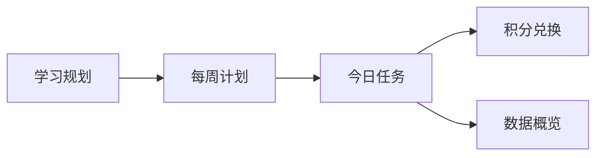

# 成长计划 · 产品定义说明书

**产品名称**：成长计划（学习进度管理）  
**版本范围**：当前已实现的家庭本地版（Web / 桌面壳）  
**主要使用者**：家长（管理与评价）与孩子（执行与兑换）  
**运行方式**：本地应用，数据存在本机 SQLite，无需账号登录  

---

## 1. 产品一句话

帮家长把「长期提分目标 → 每周学习安排 → 当天执行评价 → 积分激励兑换」串成一条可落地的闭环，让孩子每天知道学什么，家长知道怎么评、怎么奖。

---

## 2. 解决什么痛点

家庭里管学习，常见卡在这几件事：

| 痛点 | 现实里的样子 | 产品怎么对上 |
| --- | --- | --- |
| 计划散、靠吼 | 作业和辅导写在便签、微信、口头约定里，第二天就忘 | 用科目长期规划 + 周计划 + 今日任务把内容固化到日期上 |
| 完成标准模糊 | 「写完了」很难判断质量，家长和孩子各执一词 | 任务自带积分规则（字迹与过程、专注度、正确率等），完成时按维打分 |
| 激励断档 | 说好的游戏时间、零花钱靠临场谈判，规则不稳 | 积分可累计、可兑换家庭共同认可的奖励 |
| 多孩难切 | 一个家多个孩子，计划混在一起 | 顶部切换孩子档案，计划 / 任务 / 积分各自独立 |
| 看不到趋势 | 忙完当天就散了，不知道这周有没有进步 | 数据概览汇总今日 / 本周完成率与积分变化 |

第一版刻意不做账号体系和复杂权限：打开就能用，适合家庭私有环境。

---

## 3. 产品价值

**对家长**

- 把「该学什么」从脑内备忘变成可生成、可调整的计划资产。
- 用统一评价口径打分，积分自动入账，减少临场纠结。
- 用奖励目录把家庭激励规则说清楚，兑换有记录可查。

**对孩子**

- 打开「今日任务」就知道今天有几项、大概多久、能拿多少分。
- 拖拽改状态、完成打分后立刻看到积分变化，反馈快。
- 想兑换什么（零钱、游戏时间、外出吃饭）提前看得见，有目标感。

**对家庭协作**

- 同一套规则服务多个孩子；奖励目录可全家共享，避免每个孩子各建一套奖品。

---

## 4. 核心流程

产品主链路是四步，对应侧栏四个主模块：



1. **学习规划**：按科目设定总目标、辅导资料与长期事项（频率、时长、积分规则）。
2. **生成 / 编辑每周计划**：把规划事项落到具体一周的每一天；可按科目筛选，可拖拽调整状态。
3. **今日执行与评价**：当天任务看板（列表或卡片）；完成时按维度打分，获得实得积分。
4. **积分激励**：查看余额，兑换奖励；也可登记学校表扬、家务等额外渠道积分。

辅助环节：

- **基础设置**：维护孩子档案、学期起止、本学期目标。
- **数据概览**：回看完成率与积分趋势，辅助下周调整。

---

## 5. 功能说明（含截图）

截图取自本机运行中的真实界面，存放于 `docs/product/screenshots/`。

### 5.1 今日任务

**做什么**：当天学习的主工作台。左侧看各科进度，右侧用看板管理任务状态（未开始 / 已完成 / 已作废 / 已延期）。

**关键能力**

- 按科目看完成比例与进度条
- 列表 / 卡片两种展示
- 拖拽改状态；完成任务进入打分
- 顶部汇总：任务总数、已完成、可获积分、已获积分


### 5.2 完成并打分

**做什么**：家长对单项任务按积分规则打分，填写实际时长，确认后计入积分流水。

**关键能力**

- 默认带出各维度满分，可按实际表现下调或上调（可超标准）
- 系统汇总实得积分并写回任务状态


### 5.3 学习规划

**做什么**：科目级的长期提分蓝图。不是某一周的日历，而是「这个科目长期要做什么」。

**关键能力**

- 科目列表 + **新增科目**（支持羽毛球、编程等自定义科目）
- 科目总目标：当前分 / 目标分 / 目标日期
- 规划事项：执行频率、时长、辅导资料、积分规则、启用状态
- 辅导资料：挂接教辅 / 讲义等资源
- **生成周计划**：把当前规划落到某一周


### 5.4 每周计划

**做什么**：七天执行视图。左侧切周、切天，右侧看当天任务清单；可按科目筛选，并与今日任务共用状态看板能力。

**关键能力**

- 按周浏览（如「第一周」）
- 每天时长与任务数预览
- 列表 / 卡片切换、拖拽改状态


### 5.5 积分兑换

**做什么**：把学习结果变成家庭可兑现的激励。

**关键能力**

- 累计获得 / 可兑换 / 本周获得 / 本周已兑
- **奖品**：共享奖励目录（零钱、游戏时间、外出等），可配图
- **积分获取**：除任务得分外，可登记学校表扬、目标达成、家务、作业优秀等额外渠道
- **兑换记录**：留痕可查


### 5.6 数据概览

**做什么**：用数字回看执行质量，方便家长调强度、调科目重心。

**关键能力**

- 今日 / 本周完成情况与积分卡片
- 本周任务数量、积分对比柱状图
- 本月完成率与积分获取趋势


### 5.7 基础设置

**做什么**：维护孩子档案与学期时间轴。

**关键能力**

- 孩子姓名、年级、学校、头像、本学期目标
- 学期起止日期（驱动顶部「本学期共 X 周 · 当前第 Y 周」）
- 多孩档案切换（顶部孩子选择器）


---

## 6. 功能地图（对照侧栏）

| 模块 | 用户目标 | 当前状态 |
| --- | --- | --- |
| 今日任务 | 当天执行、评价、拿分 | 已实现 |
| 学习规划 | 长期事项与目标、生成周计划 | 已实现 |
| 每周计划 | 七天编排与执行状态 | 已实现 |
| 积分兑换 | 奖励、额外积分、兑换记录 | 已实现 |
| 数据概览 | 完成率与积分趋势 | 已实现 |
| 基础设置 | 孩子档案与学期 | 已实现 |
| 错题本 | 错题归档与订正 | 需求已有，侧栏未作为主入口交付 |

---

## 7. 设计原则（产品约束）

这些约束决定了当前版本「做成什么样」：

1. **家庭本地优先**：数据在本机，不强制联网账号。
2. **家长主导评价**：积分来自家长确认的打分，而不是孩子自报完成。
3. **计划可生成、可改**：周计划可从科目规划生成，也可手工增删改。
4. **激励可兑现**：奖励可配图、可标积分门槛，兑换写入流水。
5. **多孩独立、奖励可共享**：学习数据按孩子隔离，奖励目录可全家共用。

---

## 8. 非目标（当前版本不做）

- 学校 / 老师多租户协作与布置作业
- 云同步、账号登录与权限体系
- 自动批改作业或精确正确率算法（正确率维度由家长按档打分）
- 完整的阶段冲刺计划（月考冲刺等）作为独立主流程入口

更细的历史需求与延后清单见仓库根目录 `requirements.md`；领域术语见 `CONTEXT.md`。

---

## 9. 成功标准（怎么算用起来了）

家庭连续使用两周以上，通常能观察到：

1. 每天打开「今日任务」就能看到当日清单，不再靠口头催促凑计划。
2. 完成任务后有稳定的打分动作，积分余额与兑换记录对得上。
3. 科目规划里的事项能生成到周计划，周末复盘时能在数据概览看到完成率变化。
4. 孩子能指出「我还差多少分兑换周末游戏」，激励规则被双方记住。

---

## 10. 截图更新说明

如需重新截取界面图，可在本地 `npm run dev` 后执行：

```bash
node scripts/capture-product-shots.mjs
```

完整页面集中截图脚本可按同样方式扩展；当前文档引用的文件名与 `docs/product/screenshots/` 目录保持一致。
