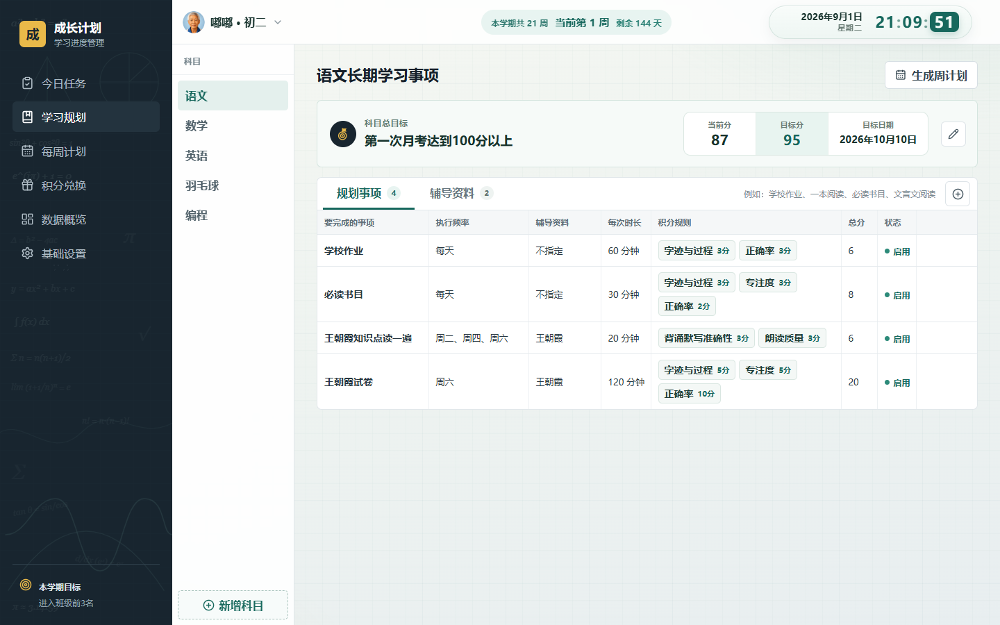
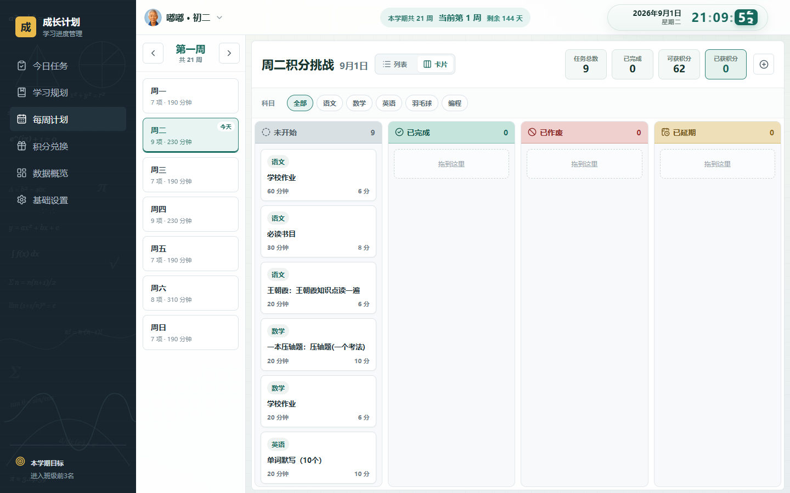
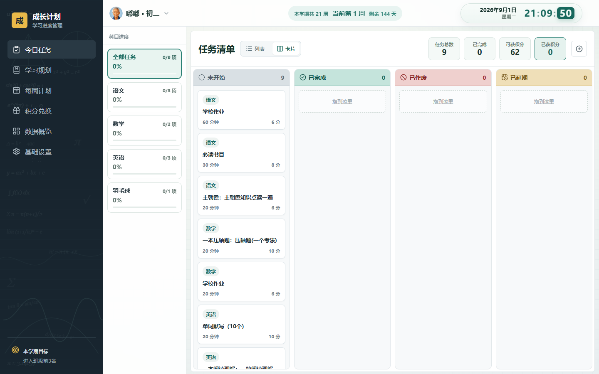
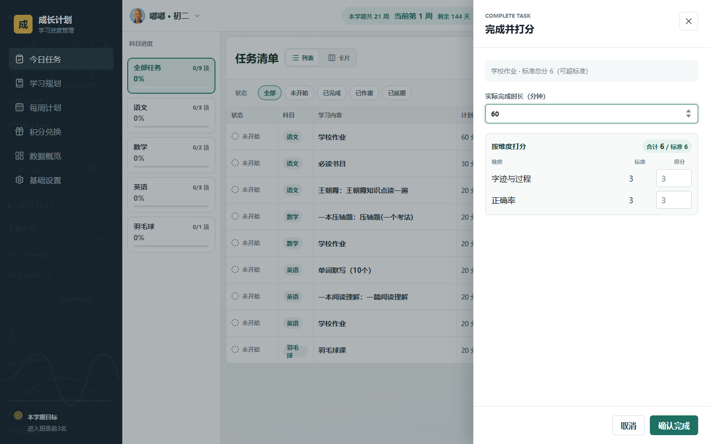
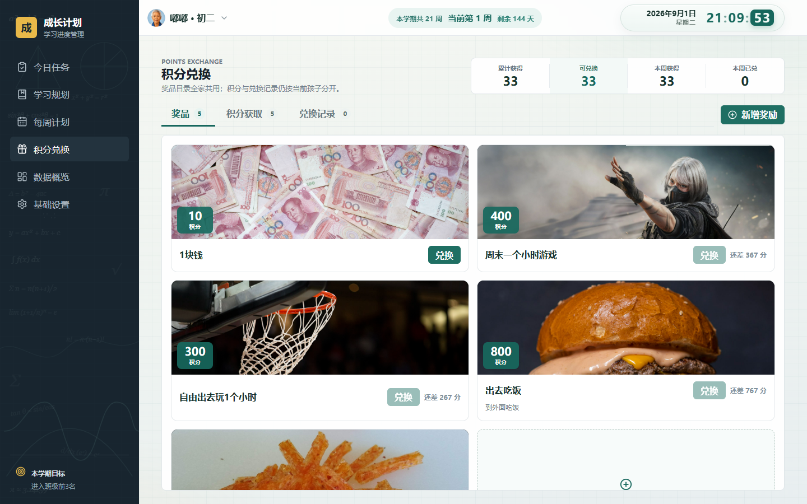
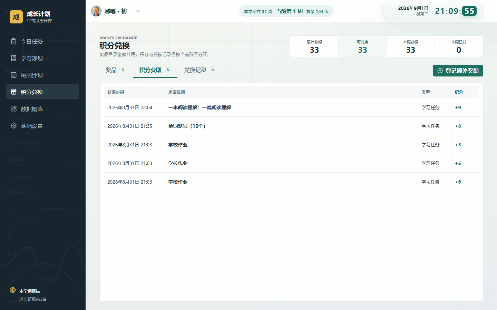
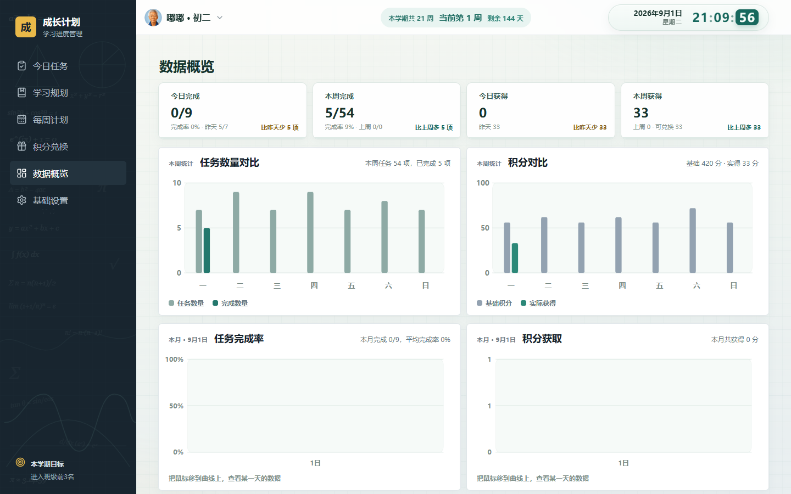
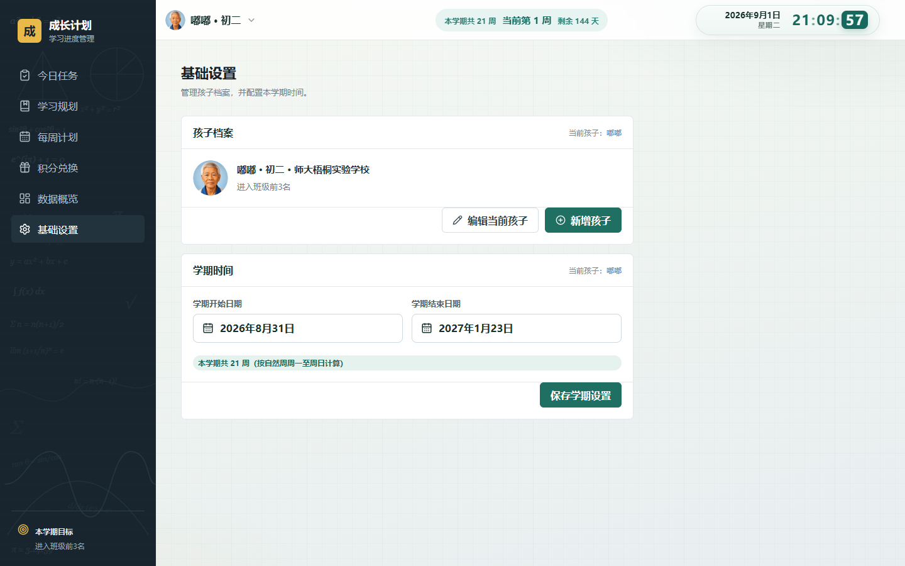

# 孩子每天学什么，别再靠吼了

我们做了一个家庭学习小工具：**成长计划**。

不是又一个作业打卡 App，也不是学校那种大而全的平台。它就干一件事：把家里的学习计划、家长评价、积分奖励，串成一条每天能走完的路。

数据存在自己电脑里，不用注册账号，打开就能用。

---

## 先说家里真实的乱

很多家庭其实不是不努力，是信息太散：

作业在学校群里，辅导在口头约定里，奖励靠临场谈判。

孩子说「写完了」，家长觉得质量不行；家长说「再练半小时」，孩子觉得没底。周末想复盘，翻聊天记录翻半天，也说不清这周到底完成了多少。

要是家里有两个孩子，计划更容易搅成一锅粥。

我们想要的，其实很朴素：

每天知道学什么；学完了怎么评；评完了分数往哪走；分数能换成什么。

---

## 我们的做法：四步走完一天

成长计划把这条链路收成四个入口：**学习规划 → 每周计划 → 今日任务 → 积分兑换**。

家长管规则，孩子管执行。两边看到的是同一套账。

### 1. 先把「长期要做什么」写清楚

别一上来就排今天的作业单。先问：这个科目本阶段想冲到哪？

比如语文：第一次月考 100 分以上。当前 87，目标 95，截止日期写上。

再把长期事项列出来：学校作业、必读书目、文言文阅读……每项写清频率、时长、用哪本辅导资料，以及怎么打分。

科目不够用？旁边有「新增科目」。羽毛球、编程，一样能加进来。

写完后点「生成周计划」，这些事项会落到具体一周里。不用每天从零拼。

### 2. 一周怎么排，看得见

每周计划按天看：周一到周日，每天大概多少分钟、几项任务。

可以按科目筛选，也可以在卡片和列表之间切换。今天忙不过来，延期、作废，状态都留痕，不会悄悄消失。

### 3. 打开今天，就盯这一天

「今日任务」是孩子和家长晚上最常打开的页。

左边是科目进度：语文、数学、英语各完成了多少。右边是任务看板：未开始、已完成、已作废、已延期。

想拖就拖。今天一共几项、还能拿多少分、已经拿了多少分，顶上一眼能看见。

真正改变家庭气氛的，是「完成并打分」。

不是勾个「完成」就完事。字迹与过程、专注度、正确率，分开给分。家长有尺子，孩子也知道分数从哪来。

打完分，积分立刻进账。

### 4. 分数要能换成真东西

积分如果只能看不能花，孩子很快就不信了。

成长计划里可以建奖励：一块钱、周末一小时游戏、出去吃饭、辣条……自己家定规矩，自己定价。

差多少分能兑换，卡片上写得很直白。本周拿了多少、兑了多少，也摊在桌上。

学校群里被表扬、家务做得漂亮、作业特别优秀？也可以记一笔「额外积分」。任务得分不是唯一通道，但每笔都有类别和记录。

---

## 周末别靠感觉复盘

忙完五天，很多人只记得「好像挺累」。

数据概览把今天、本周的完成率和积分摊开，再配上几天的对比图。调强度、换科目重心，有数可依。

家里不止一个孩子？顶部切换档案就行。计划、任务、积分各自独立；奖励目录可以全家共用，不用给每个孩子各建一套奖品库。

孩子档案、学期起止、本学期目标，都在基础设置里。顶部那句「本学期共多少周、现在第几周」，就是从这里来的。

---

## 它适合谁

更适合愿意花一点时间定规则的家长：

你愿意先把科目目标和事项写清楚，也愿意每天花一两分钟打分。  
孩子愿意看着积分去够那个周末游戏、那顿外出吃饭。

它不适合指望软件自动催作业、自动批改试卷的人。评价权在家长手里，这是刻意的选择。

本地用、不登录，也是刻意的：学习数据留在家里，先把闭环跑顺。

---

## 用两周，怎么算「真的用起来了」

别看功能多不多。看这四件事有没有发生：

每天打开今日任务，清单是现成的，不用再吼着拼。  
完成任务后有稳定的打分动作，积分和兑换对得上。  
科目规划能生成到周计划，周末能在概览里看见完成率变化。  
孩子自己能说出：「我还差多少分，才能兑换周末游戏。」

如果这四件事开始发生，家里的学习协作，大概已经从「临场谈判」变成了「共同遵守的小系统」。

---

**成长计划**：本地家庭学习进度与积分奖励管理。

欢迎留言说说你家现在怎么管作业和奖励。我们还在打磨细节，真实场景最有用。
